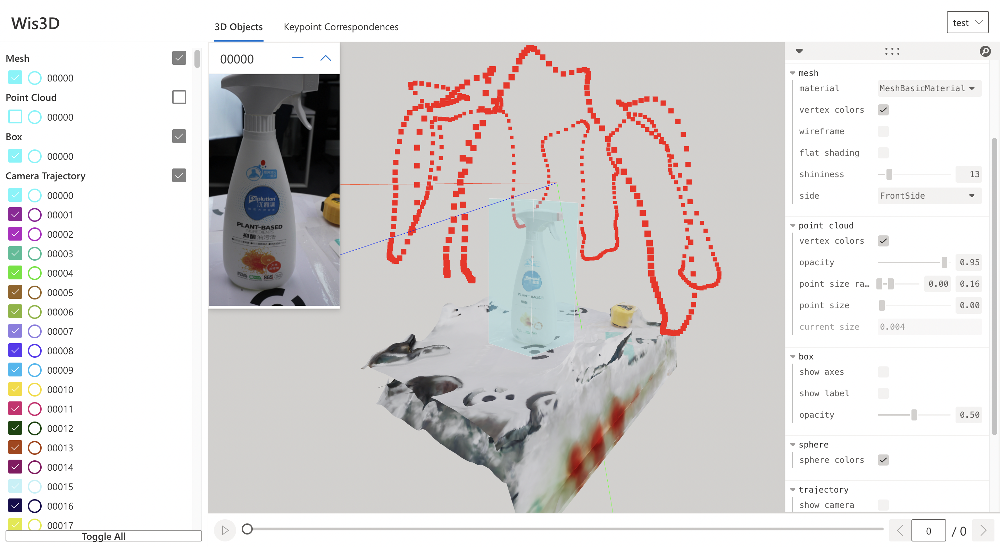
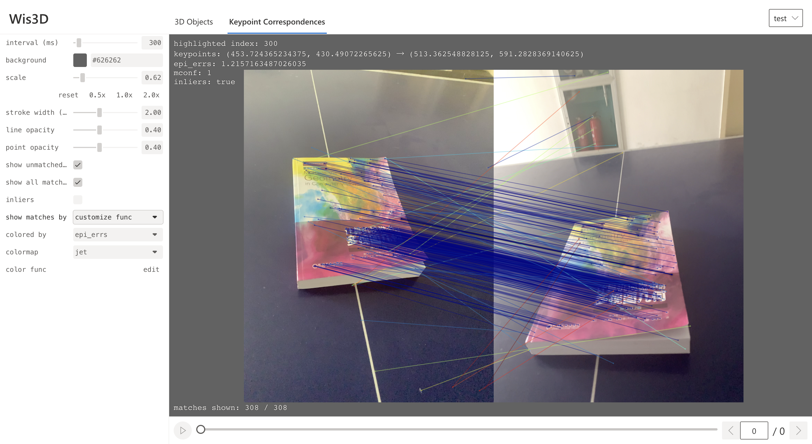

# Wis3D: A web-based 3D visualization tool for 3D computer vision
[Installation](#basic-installation) | [Tutorial](#basic-installation) | [Documentation](http://dgpu.idr.ai:19092/)

Wis3D is a web-based 3D visualization tool built for 3D computer vision researchers. You can import 3D bounding box, point clouds, meshes and feature correspondences directly from your python code and view them in your local browser. You can think of it as [TensorBoard](https://www.tensorflow.org/tensorboard) but with 3D data as the first-class citizen.
<p align="center">
  
  
  
</p>

## Basic Installation

### Install from PyPI

```bash
pip install wis3d
```

### or Build from source

1. install [Node.js](https://nodejs.org/en/download/)
2. run `pip install -r requirements.txt`
3. build web pages
   ```bash
   cd wis3d/app
   npm install # install dependencies
   npx next build
   npx next export
   ```
4. install package
   ```bash
   cd ../..
   python setup.py develop
   ```

## Web Page




##  Quick Start
### Add visualization data

```python
# coding=utf-8
from wis3d import Wis3D
import trimesh
from PIL import Image
from transforms3d import affines, quaternions
import os
import numpy as np

wis_dir = "path_to_vis_dir"
wis3d = Wis3D(wis_dir, 'test')

# add point cloud
pcd_path = 'path_to_ply_file'
wis3d.add_point_cloud(pcd_path, name='pcd0')
pcd = trimesh.load_mesh(pcd_path)
wis3d.add_point_cloud(pcd, name='pcd1')
wis3d.add_point_cloud(pcd.vertices, pcd.colors, name='pcd2')


# add mesh
mesh_path = 'path_to_mesh_file'
wis3d.add_mesh(mesh_path, name='mesh0')
mesh = trimesh.load_mesh(mesh_path)
wis3d.add_mesh(mesh, name='mesh1')
wis3d.add_mesh(mesh.vertices, mesh.faces,
               mesh.visual.vertex_colors[:, :3], name='mesh2')

# add image
image_path = 'path_to_image_file'
wis3d.add_image(image_path, name='image0')
image = Image.open(image_path)
wis3d.add_image(image, name='image1')
wis3d.add_image(np.asarray(image), name='image2')

# add box
points = np.array([
    [-0.5, -0.5, -0.5],
    [0.5, -0.5, -0.5],
    [0.5, -0.5, 0.5],
    [-0.5, -0.5, 0.5],
    [-0.5, 0.5, -0.5],
    [0.5, 0.5, -0.5],
    [0.5, 0.5, 0.5],
    [-0.5, 0.5, 0.5]
])
wis3d.add_boxes(points, name='box0', labels='test0')
wis3d.add_boxes(points.reshape(1, 8, 3) + 0.6, name='box1', labels=['test1'])
wis3d.add_boxes([0.5, 0.2, 0.1], [1.24, 3.0, 2.1], [0.5, 0.6, 0.7], name='box2', labels='test2')
wis3d.add_boxes([[0.2, 0.6, 0.3],[0.5, 0.9, 1.0]], [[2.24, 1.0, 3.1], [0.6, 2.9, 2.1]], [[0.2, 0.5, 0.8], [0.4, 0.6, 0.8]], name='box3', labels='test3')

# add line
wis3d.add_lines(np.array([0, 0, 0]),np.array([1, 1, 1]), name='line0')
colors = np.array([[0, 255, 0], [0, 0, 255]])
wis3d.add_lines(np.array([[0, 1, 0], [0, -1, 0]]), np.array([[1, 0, 0], [1, 0, 0]]), colors, name='line1')

# add voxel
wis3d.add_voxel(np.array([[1.0, 1.0, 1.0], [-1, -1, -1]]), 0.1, np.array([[255, 255, 255], [0, 0, 0]]), name='voxel0')

# add sphere
wis3d.add_spheres(np.array([0, 0, 0]), 0.5, name='sphere0')
wis3d.add_spheres(np.array([[0, 1, 0], [0, 0, 1]]), 0.5, name = 'sphere1')
wis3d.add_spheres(np.array([[0, 1, 0], [0, 0, 1]]), np.array([0.25, 0.5]),np.array([[0, 255, 0], [0, 0, 255]]), name='sphere2')

```
You can also reference to `examples/test.py`. For more usage, see [Documentation](http://dgpu.idr.ai:19092/)

### Start the Web Server

Start the web service to view the visualization in the browser.

```bash
wis3d --vis_dir $path_to_vis_dir --host 0.0.0.0 -port 19090
```

Open your browser, and enter http://localhost:19090 to see the results.


## Authors
 - Project lead: [Jiaming Sun](https://jiamingsun.ml), [Xiaowei Zhou](https://xzhou.me)
 - Core members: [Jingmeng Zhang](https://github.com/ahazss), [Hongcheng Zhao](https://github.com/HongchengZhao), [Siyu Zhang](https://derizsy.github.io)
 - Past contributors: Zijing Huang


## Citation
```
@article{sun2022onepose,
    title={{OnePose}: One-Shot Object Pose Estimation without {CAD} Models},
    author = {Sun, Jiaming and Wang, Zihao and Zhang, Siyu and He, Xingyi and Zhao, Hongcheng and Zhang, Guofeng and Zhou, Xiaowei},
    journal={CVPR},
    year={2022},
}
```